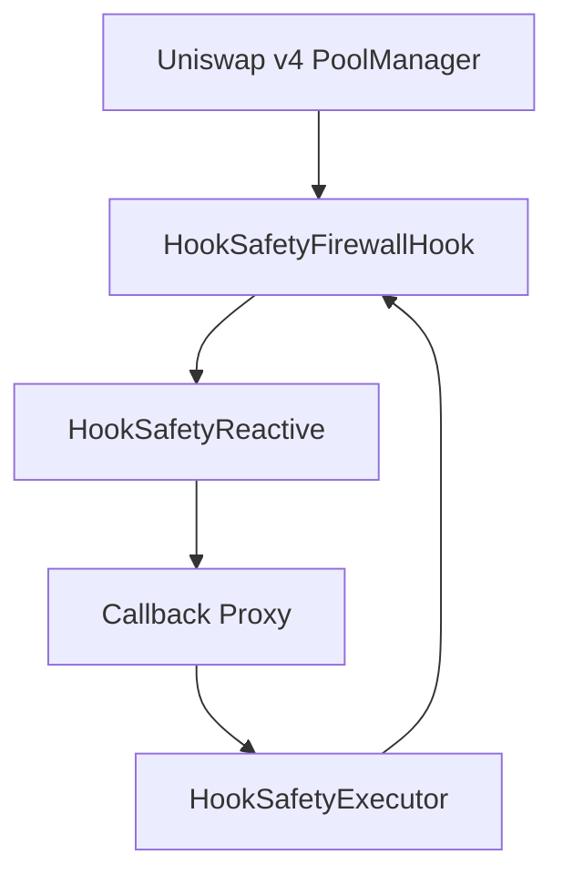

# Hook Safety-as-a-Service

## Integrations

[](https://docs.uniswap.org/contracts/v4/overview)
[](https://dev.reactive.network/)

Autonomous security firewall for Uniswap v4 hooks.

Problem:

- Hooks add programmable power and attack surface.
- MEV, flash anomalies, toxic flow, and manipulation can escalate before manual intervention.

Solution:

- On-hook telemetry + deterministic risk scoring + Reactive callback mitigation.
- The system can increase fees, throttle swaps, and pause in short windows.

## Repo Layout

```text
/
  context/
  assets/
  docs/
  scripts/
  contracts/
  reactive/
  frontend/
  shared/
  spec.md
  README.md
  SECURITY.md
  CONTRIBUTING.md
  .github/workflows/ci.yml
```

## Architecture

```mermaid
flowchart LR
    Origin[Origin chain\nUniswap v4 + HookSafetyFirewallHook]
    Reactive[Reactive chain\nHookSafetyReactive]
    Destination[Destination chain\nHookSafetyExecutor]

    Origin -->|SecurityTelemetry| Reactive
    Reactive -->|Callback(payload)| Destination
    Destination -->|applyMitigation| Origin
```

## Component Interaction



## Quick Start

### 1) Bootstrap deterministic dependencies

```bash
make bootstrap
```

### 2) Install workspace packages

```bash
npm install
```

### 3) Build and test contracts

```bash
npm run contracts:build
npm run contracts:test
npm run contracts:coverage
```

### 4) Build frontend dashboard

```bash
npm run frontend:build
```

## Deployments

Foundry scripts:

- `scripts/foundry/00_DeployHookFirewall.s.sol`
- `scripts/foundry/01_DeployExecutor.s.sol`
- `scripts/foundry/02_DeployReactive.s.sol`

Target environments:

- Local anvil
- Base Sepolia
- Reactive Lasna

## Demo Commands

```bash
make demo-local
make demo-sepolia
```

`demo-sepolia` prints tx hashes and explorer URLs in this format:

```text
Tx: Attack Simulation
BaseSepolia: https://sepolia.basescan.org/tx/<txid>
Lasna: https://lasna.network/tx/<txid>
```

## Security Guarantees and Limits

- Callback authenticity and RVM binding enforced.
- Replay protection and idempotent mitigation enabled.
- Deterministic scoring and bounded thresholds.
- Not attack-proof; see `SECURITY.md` for threat model and residual risks.

## Dependency Determinism

- Single root Node lockfile (`package-lock.json`).
- Solidity dependencies pinned via submodules + `scripts/bootstrap.sh`.
- CI validates dependency integrity before tests.

## Assumptions / TBD

- See [docs/ASSUMPTIONS.md](docs/ASSUMPTIONS.md).
