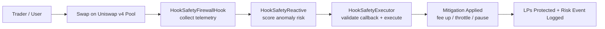
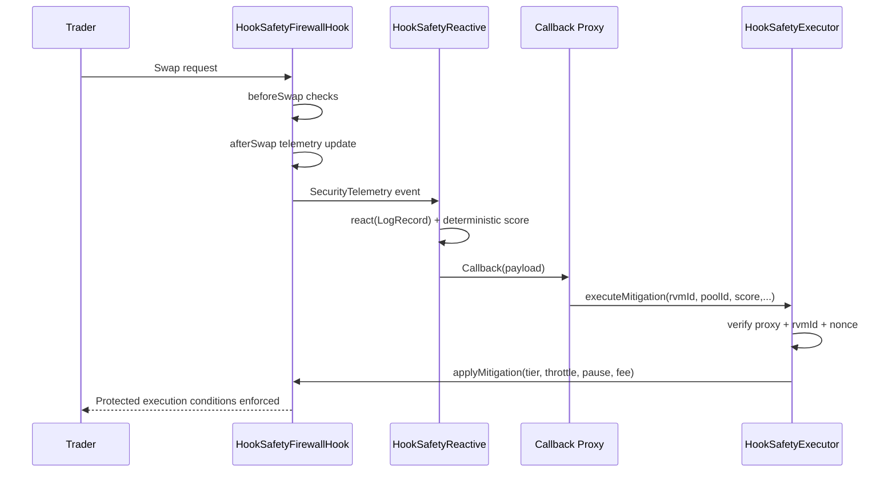

# Hook Safety-as-a-Service

[](https://github.com/blue-benz/Hook-Safety-as-a-Service/actions/workflows/test.yml)
[](#test-coverage-and-proof)
[](https://docs.soliditylang.org/)
[](https://book.getfoundry.sh/)
[](LICENSE)

A production-grade, deterministic security firewall for Uniswap v4 hooks that detects abnormal flow and triggers real-time protections through Reactive callbacks.

## Problem

AMM pools are increasingly exposed to fast, adversarial execution:

- Sandwich attacks and toxic order flow can extract LP value between blocks.
- Flash-loan-driven spikes can create false pricing and drain liquidity.
- Manual intervention is too slow once an exploit path is active.
- Hook-enabled custom logic expands both capability and attack surface.

## Solution

Hook Safety-as-a-Service combines on-hook telemetry with Reactive automation:

- The Uniswap v4 hook captures swap, fee, liquidity, and volatility signals.
- A Reactive contract scores risk deterministically (`react(LogRecord)`).
- An authenticated executor applies mitigations in real time:
  - Dynamic fee hardening
  - Temporary throttling
  - Short emergency pause windows
- Replay protection, callback authentication, and idempotent handling are built in.

## Integrations

[](https://docs.uniswap.org/contracts/v4/overview)
[](https://dev.reactive.network/)

- `Uniswap v4`: Hook lifecycle integration (`beforeSwap` / `afterSwap`) and pool telemetry.
- `Reactive Network (Lasna)`: Log subscriptions, deterministic scoring, callback trigger path.
- `Unichain Sepolia`: Destination execution path for mitigation actions and public tx verification.

## Major Components

- `contracts/src/hooks/HookSafetyFirewallHook.sol`
  - Pool telemetry emitter, pre-swap guardrails, dynamic fee override.
- `contracts/src/reactive/HookSafetyReactive.sol`
  - Reactive subscriber + deterministic risk model + callback emission.
- `contracts/src/executor/HookSafetyExecutor.sol`
  - Callback proxy/RVM validation, replay-safe mitigation execution.
- `contracts/src/libraries/RiskMath.sol`
  - Bounded and deterministic risk signal normalization/scoring.
- `contracts/test/**`
  - Unit, security, fuzz/invariant, and integration suites.
- `scripts/foundry/**`, `scripts/deploy/**`, and `scripts/demo/**`
  - Deployment and demo automation for local and Unichain Sepolia/Lasna runs.
- `frontend/**`
  - Operator dashboard for risk signals and mitigation lifecycle visibility.

## Diagrams and Flowcharts

### 1) User-Perspective End-to-End Flow



### 2) Architecture Flow (Subgraph + Mermaid)

```mermaid
flowchart LR
    subgraph ORIGIN[Origin Chain: Unichain Sepolia / Uniswap v4]
      PM[PoolManager]
      HK[HookSafetyFirewallHook]
      PM --> HK
      HK -->|SecurityTelemetry event| RN
    end

    subgraph REACTIVE[Reactive Network: Lasna / ReactVM]
      RN[HookSafetyReactive\nreact(LogRecord)]
      CB[Callback Proxy]
      RN -->|Callback payload\narg0 overwritten with ReactVM ID| CB
    end

    subgraph DEST[Destination Chain: Unichain Sepolia]
      EX[HookSafetyExecutor]
      AP[applyMitigation(...) on Hook]
      CB --> EX
      EX --> AP
    end

    AP --> HK
```

### 3) Attack Detection Lifecycle (Sequence)



## Deployed Addresses and Tx URLs

Source files:

- `deployments/local.json` (or `deployments/local.example.json`)
- `deployments/sepolia.json` (or `deployments/sepolia.example.json`)
- `deployments.md` (human-readable latest deployment ledger)

### Unichain Sepolia + Lasna (latest run)

| Item              | Network          | Value                                                                | Explorer URL                                                                                        |
| ----------------- | ---------------- | -------------------------------------------------------------------- | --------------------------------------------------------------------------------------------------- |
| Security Hook     | Unichain Sepolia | `0xfFb0f7AF7Ce0Dc1049fDc8fA25910299fd7480c0`                         | `https://sepolia.uniscan.xyz/address/0xfFb0f7AF7Ce0Dc1049fDc8fA25910299fd7480c0`                    |
| Security Executor | Unichain Sepolia | `0x9dBF31FFDdDcb68A1b39f634Dbf94Db20EF93a1F`                         | `https://sepolia.uniscan.xyz/address/0x9dBF31FFDdDcb68A1b39f634Dbf94Db20EF93a1F`                    |
| Demo Executor     | Unichain Sepolia | `0x63D36DD4a3735946Eb0544a2e3D1B593406f0fb5`                         | `https://sepolia.uniscan.xyz/address/0x63D36DD4a3735946Eb0544a2e3D1B593406f0fb5`                    |
| Reactive Contract | Lasna            | `0x8190D9D73Df94756687bF1AEe6E43d41d261D3a6`                         | `https://lasna.reactscan.net/address/0x8190D9D73Df94756687bF1AEe6E43d41d261D3a6`                    |
| Reactive Deploy Tx| Lasna            | `0x6a8c357997dcca537d4fcb82db312c966444b290b6e8a5bb871146db2ff36dc6` | `https://lasna.reactscan.net/tx/0x6a8c357997dcca537d4fcb82db312c966444b290b6e8a5bb871146db2ff36dc6` |
| Reactive Fund Tx  | Lasna            | `0x49170d35d581c419b7acaf3b81d3d83b6bf212727a484d354be62f20ea8b8015` | `https://lasna.reactscan.net/tx/0x49170d35d581c419b7acaf3b81d3d83b6bf212727a484d354be62f20ea8b8015` |
| Deploy Hook Tx    | Unichain Sepolia | `0x489f102a971ad4cbe45f3085cf06068242739fedfb19ef0331d2a64d78954c05` | `https://sepolia.uniscan.xyz/tx/0x489f102a971ad4cbe45f3085cf06068242739fedfb19ef0331d2a64d78954c05` |
| Deploy Executor Tx| Unichain Sepolia | `0x11d709996e00c3fa4563ed01b6f9c6a9fd19720ce30972a298f6586340522a98` | `https://sepolia.uniscan.xyz/tx/0x11d709996e00c3fa4563ed01b6f9c6a9fd19720ce30972a298f6586340522a98` |
| Deploy Demo Tx    | Unichain Sepolia | `0xb31a0d6bd9295d0fd3b6a35bcc083833a19af5ea8fd209e7bef478eea37c1edb` | `https://sepolia.uniscan.xyz/tx/0xb31a0d6bd9295d0fd3b6a35bcc083833a19af5ea8fd209e7bef478eea37c1edb` |

## Demo Run (With Tx URL Output)

### Run the demo scripts

```bash
make demo-local
make demo-sepolia
make demo-sepolia-live-reactive
make deploy-sepolia
```

Equivalent npm commands:

```bash
npm run demo-local
npm run demo-sepolia
npm run demo-sepolia-live-reactive
```

### Latest simulated incident demo (`scripts/demo/sepolia.sh`)

```text
[Phase 0/5] Resolve deployments
[Phase 1/5] Security baseline setup
[Phase 2/5] Attack simulation (user perspective)
[Phase 3/5] Detection trigger (simulated Reactive callback)
[Phase 4/5] Mitigation execution (escalation to emergency)
[Phase 5/5] Liquidity protection outcome

Deploy Reactive
Lasna: https://lasna.reactscan.net/tx/0xb7ebd362eb577c4eea087fea6d47673d7ab9e83552cdc7a1e3e800059ea011df

Attack Simulation
UnichainSepolia: https://sepolia.uniscan.xyz/tx/0x660eb4488d4feb56e454415b177fbeb657e70b1844d69df098189183a667167c

Detection Trigger
UnichainSepolia: https://sepolia.uniscan.xyz/tx/0x50bf5d0caec71743ddacd2c9474d2d177728e6f04fecbb5a14cc9ecb9478266c

Mitigation Execution
UnichainSepolia: https://sepolia.uniscan.xyz/tx/0x66f5209ae1a620ea000b572e30bf9eb715adfe09d006755df404ec3485178b2c
```

### Latest strict live path (`scripts/demo/sepolia-live-reactive.sh`)

```text
[Phase 0/6] Resolve deployments
[Phase 1/6] Baseline setup
[Phase 1.5/6] Allow Reactive subscription to settle
[Phase 2/6] Emit baseline telemetry
[Phase 3/6] Emit anomalous telemetry
[Phase 4/6] Await Reactive processing on Lasna + callback on Unichain
[Phase 5/6] Verify destination protection state
[Phase 6/6] Persist demo artifacts

Authorize executor:
UnichainSepolia: https://sepolia.uniscan.xyz/tx/0xe152fdddcc02105fb74e63c0db639fd2fdaa7a0c53f6c740e4dba2d72b332203

Configure pool:
UnichainSepolia: https://sepolia.uniscan.xyz/tx/0xcac52fe50c425c1c94a097e0250343c4123b248a80104bef6b0623a3add98cfa

Baseline telemetry:
UnichainSepolia: https://sepolia.uniscan.xyz/tx/0x88ff38d5bd0d2d89d622945bf154f8a10993996e97dfffc7d43a647ac5d03f58

Anomalous telemetry:
UnichainSepolia: https://sepolia.uniscan.xyz/tx/0x110a379b1a0ab21b0313cc2a0ade080540fe2b69d05ba12ffef8eb5e04153dc7

Retry anomaly:
UnichainSepolia: https://sepolia.uniscan.xyz/tx/0xb9620a3fe82c89b7f46ec04c29d95fce2d0a7bb76e10e8128f4edd47c6fe5f1d

Lasna reactive tx:
N/A (not observed in polling window)

Unichain callback tx:
N/A (not observed in polling window)
```

Assumptions / TBD:

- Reactive public testnet docs should be revalidated for Unichain Sepolia (`chainId=1301`) support before judging strict live callback expectations on this route.
- If strict `event -> react -> callback` proof is mandatory per incident, run the same path on a currently listed Reactive-supported origin/destination testnet pair.

## Command to Run the System Scripts

```bash
make bootstrap
npm install
npm run contracts:build
npm run contracts:test
make deploy-sepolia
make demo-local
make demo-sepolia
make demo-sepolia-live-reactive
```

## Test Coverage and Proof

### 100% Coverage Target

Coverage policy target is **100% line/function coverage** across core security-critical contracts.

### Latest Proof Snapshot (`npm run contracts:coverage`)

- Total Lines: **100.00%** (`364/364`)
- Total Functions: **100.00%** (`61/61`)
- Total Statements: **96.15%** (`400/416`)
- Total Branches: **79.49%** (`62/78`)

Note: Foundry reports some branch/statement anchors as unresolved (`BRDA ... -`) for optimizer-generated paths; line/function metrics are fully enforced in CI.

### Test categories included

- Unit: `contracts/test/unit/*`
- Security/Auth: `contracts/test/security/*`
- Fuzz: `contracts/test/fuzz/*`
- Invariants: `contracts/test/fuzz/HookSafetyInvariants.t.sol`
- Integration: `contracts/test/integration/*`

### Proof commands

```bash
npm run contracts:test
npm run contracts:fuzz
npm run contracts:integration
npm run contracts:coverage
```

## Future Roadmap

1. Continue increasing statement/branch hit ratios while preserving deterministic line/function 100% CI gates.
2. Add adaptive pool-class thresholds (stable, volatile, long-tail) with deterministic onchain parameter packs.
3. Extend mitigation actions with LP-side insurance hooks and configurable cooldown ladders.
4. Add richer frontend analytics for historical risk windows and incident playback.
5. Introduce multi-pool risk correlation and batched mitigation orchestration.
6. Add signed-release deployment pipelines for Unichain Sepolia and Reactive Lasna.
