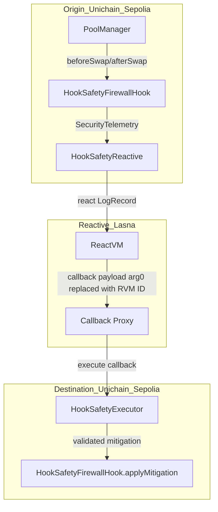
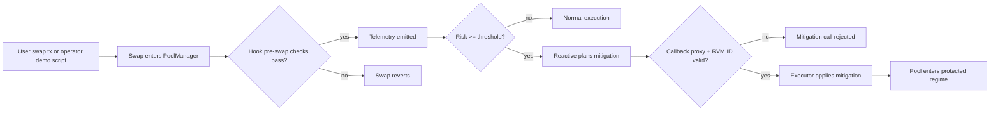
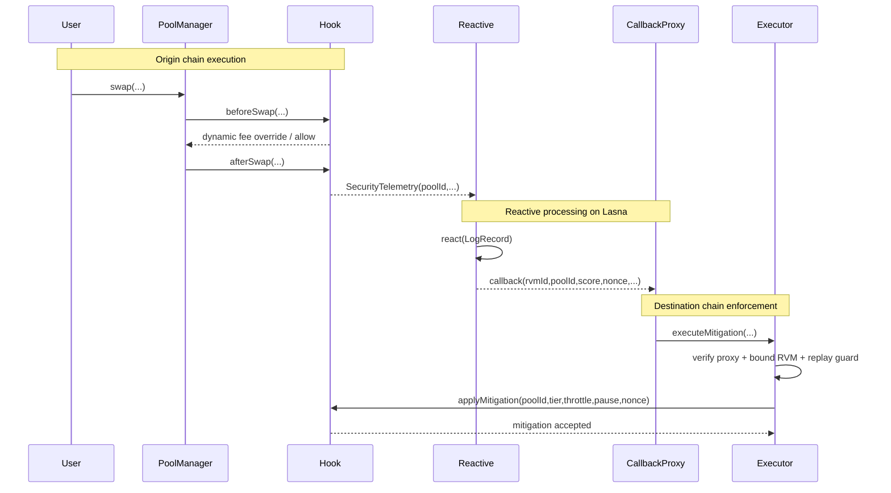

# Hook Safety-as-a-Service

**Built on Uniswap v4 x Reactive Network · Deployed on Unichain Sepolia x Reactive Lasna**
_Targeting: Uniswap Foundation Prize · Unichain Prize · Reactive Network Prize_

> A deterministic security firewall for Uniswap v4 hooks that detects abnormal swap behavior and enforces mitigation on-chain.

[](https://github.com/blue-benz/Hook-Safety-as-a-Service/actions/workflows/test.yml)


## The Problem

Uniswap v4 hooks add expressive control over swap behavior, but they also add new surfaces for adversarial flow. Without deterministic policy and authenticated execution boundaries, abnormal flow can degrade LP outcomes before an operator can intervene.

| Layer | Failure Mode |
| --- | --- |
| Swap execution | Sandwich and toxic order flow degrade LP value |
| Liquidity profile | Flash-loan volume spikes mimic organic demand |
| Price path | Sudden deviation and slippage spikes trigger bad fills |
| Mitigation path | Unauthorized or replayed callbacks mutate policy state |

The consequence is value leakage and unstable pool behavior under high-speed adversarial conditions.

## The Solution

The system implements an Origin -> Reactive -> Destination protection loop.

1. `HookSafetyFirewallHook` emits deterministic telemetry per pool event.
2. `HookSafetyReactive.react(LogRecord)` computes a bounded risk score.
3. A mitigation plan is emitted from Lasna with evidence-bound metadata.
4. Destination callback path is authenticated (callback proxy + bound ReactVM ID).
5. `HookSafetyExecutor.executeMitigation(...)` enforces fee tier, throttle, and pause controls.
6. Mitigation nonce/state are replay-protected and idempotent.

Core insight: keep detection and enforcement fully verifiable in contract state transitions, not off-chain heuristics.

## Architecture

### Component Overview

```text
contracts/src/
  hooks/
    HookSafetyFirewallHook.sol        # Uniswap v4 hook telemetry + local guardrails
  reactive/
    HookSafetyReactive.sol            # Reactive log subscriber + risk scoring + callback emission
    base/AbstractReactive.sol         # Reactive runtime/auth plumbing
  executor/
    HookSafetyExecutor.sol            # Callback auth + replay-safe mitigation execution
  libraries/
    RiskMath.sol                      # Deterministic bounded risk math
  common/
    Owned.sol                         # Ownership and privilege boundary
```

### Architecture Flow (Subgraphs)



### User Perspective Flow



### Interaction Sequence



## Risk Regimes

| Regime | Score Range | Effect |
| --- | --- | --- |
| Normal | `< mediumThreshold` | Base fee path, no throttle/pause |
| Elevated | `>= mediumThreshold and < highThreshold` | Fee hardening + temporary throttle |
| Critical | `>= highThreshold` | Maximum fee tier + emergency pause window |

Temporal correlation and direction-flip inputs reduce false positives by requiring consistent anomaly context before escalation.

## Deployed Contracts

### Unichain Sepolia (chainId 1301)

| Contract | Address |
| --- | --- |
| HookSafetyFirewallHook | [0xfFb0f7AF7Ce0Dc1049fDc8fA25910299fd7480c0](https://sepolia.uniscan.xyz/address/0xfFb0f7AF7Ce0Dc1049fDc8fA25910299fd7480c0) |
| HookSafetyExecutor | [0x9dBF31FFDdDcb68A1b39f634Dbf94Db20EF93a1F](https://sepolia.uniscan.xyz/address/0x9dBF31FFDdDcb68A1b39f634Dbf94Db20EF93a1F) |
| Demo Executor | [0x75AE62C4fEDa0ADE4f2811116778B1D6269774f7](https://sepolia.uniscan.xyz/address/0x75AE62C4fEDa0ADE4f2811116778B1D6269774f7) |

### Reactive Lasna (chainId 5318007)

| Contract | Address |
| --- | --- |
| HookSafetyReactive | [0x0d2e3Bd178EA6eA17B9B291eda532C39F22ef84E](https://lasna.reactscan.net/address/0x0d2e3Bd178EA6eA17B9B291eda532C39F22ef84E) |

## Live Demo Evidence

Demo run date: **March 11, 2026**

### Phase 1 - Deployment and funding

| Action | Transaction |
| --- | --- |
| Deploy hook (Unichain Sepolia) | [0x489f102a...](https://sepolia.uniscan.xyz/tx/0x489f102a971ad4cbe45f3085cf06068242739fedfb19ef0331d2a64d78954c05) |
| Deploy executor (Unichain Sepolia) | [0x11d70999...](https://sepolia.uniscan.xyz/tx/0x11d709996e00c3fa4563ed01b6f9c6a9fd19720ce30972a298f6586340522a98) |
| Deploy reactive (Lasna) | [0xfc596e28...](https://lasna.reactscan.net/tx/0xfc596e28a28693b8181fc0c64c3a3664caf3e3952d935e82d8cb49735db7d859) |
| Fund reactive (Lasna) | [0xa4aa1de9...](https://lasna.reactscan.net/tx/0xa4aa1de9b687bfe558c9b663def68a771f3ca46b52d6b8030b1e2b88918bc70b) |

### Phase 2 - Strict live reactive loop

| Action | Transaction |
| --- | --- |
| Baseline telemetry (Unichain Sepolia) | [0x8b969d1d...](https://sepolia.uniscan.xyz/tx/0x8b969d1d9e9e4c2eeb4fa5ef0a02d1d95dd0efd79a1f09f7d129621d82f6b689) |
| Anomaly telemetry (Unichain Sepolia) | [0x38e55a12...](https://sepolia.uniscan.xyz/tx/0x38e55a126d78a41f41300e7b5342ab2638c80a9d9848070866f62b3226bd850d) |
| Mitigation planned event (Lasna) | [0x7cbb3c6f...](https://lasna.reactscan.net/tx/0x7cbb3c6f51010814d03014543dc516db9c32feebe1f0ee51580b56e00304503c) |
| Callback proxy attempt (Unichain Sepolia) | [0xab92ec0e...](https://sepolia.uniscan.xyz/tx/0xab92ec0e42d1b1b0cb27482c0e5f8c844e1facbd58a94d15782882c2c437c29a) |

### Phase 3 - Simulated incident response

| Action | Transaction |
| --- | --- |
| Attack simulation (Unichain Sepolia) | [0x660eb448...](https://sepolia.uniscan.xyz/tx/0x660eb4488d4feb56e454415b177fbeb657e70b1844d69df098189183a667167c) |
| Detection trigger (Unichain Sepolia) | [0x50bf5d0c...](https://sepolia.uniscan.xyz/tx/0x50bf5d0caec71743ddacd2c9474d2d177728e6f04fecbb5a14cc9ecb9478266c) |
| Mitigation execution (Unichain Sepolia) | [0x66f5209a...](https://sepolia.uniscan.xyz/tx/0x66f5209ae1a620ea000b572e30bf9eb715adfe09d006755df404ec3485178b2c) |

> Some lifecycle assertions are read from chain state via `cast call` and printed by demo scripts to prove post-transaction mitigation state.

## Running The Demo

```bash
# full strict live run (Unichain + Lasna)
make demo-sepolia-live-reactive
```

```bash
# phase-based sepolia demonstration (uses deployed contracts)
make demo-sepolia
```

```bash
# local deterministic lifecycle demonstration
make demo-local
```

```bash
# deploy contracts before demo (if needed)
make deploy-sepolia
```

## Test Coverage

```text
Lines:      100.00% (395/395)
Statements: 95.99% (431/449)
Branches:   77.78% (63/81)
Functions:  100.00% (62/62)
```

Reproduce coverage:

```bash
forge coverage --exclude-tests --no-match-coverage 'scripts/' --report summary
```

- Unit tests: contract-level behavior and access controls.
- Security tests: callback authentication, RVM binding, replay rejection.
- Fuzz tests: bounded risk math and ratio saturation invariants.
- Invariant tests: mitigation nonce monotonicity over randomized calls.
- Integration tests: telemetry -> reactive plan -> mitigation lifecycle.
- Economic correctness tests: deterministic mitigation escalation behavior.

## Repository Structure

```text
src/       -> contracts/src/
scripts/   -> scripts/
test/      -> contracts/test/
docs/      -> docs/
```

## Documentation Index

| Doc | Description |
| --- | --- |
| [spec.md](spec.md) | System architecture, risk model math, trust boundaries |
| [SECURITY.md](SECURITY.md) | Threat model, assumptions, and residual risks |
| [CONTRIBUTING.md](CONTRIBUTING.md) | Development setup and contribution workflow |
| [docs/ASSUMPTIONS.md](docs/ASSUMPTIONS.md) | Explicit assumptions and open items |
| [deployments.md](deployments.md) | Deployment ledger and verified tx evidence |

## Key Design Decisions

**Why deterministic risk scoring on-chain?**  
Deterministic scoring keeps policy transitions auditable from emitted telemetry to final mitigation state. Off-chain model outputs were rejected for this phase because they break reproducibility and increase trust assumptions.

**Why explicit callback proxy + bound ReactVM ID checks?**  
Reactive callbacks cross trust boundaries. The executor validates both sender and expected ReactVM identity, then enforces nonce guards to prevent replay or forged mitigation execution.

**Why idempotent mitigation updates?**  
Cross-network sequencing can produce delayed or repeated callback attempts. Idempotent nonce/state handling ensures duplicate messages cannot corrupt or regress protection state.

## Roadmap

- [ ] Increase statement/branch coverage while preserving line/function 100% gates.
- [ ] Add pool-class policy packs (stable, volatile, long-tail) with bounded params.
- [ ] Add richer LP protection primitives and cooldown ladders.
- [ ] Extend multi-pool correlation scoring for coordinated attack windows.
- [ ] Prepare independent audit package and publish post-audit diffs.

## License

MIT. See [LICENSE](LICENSE).
