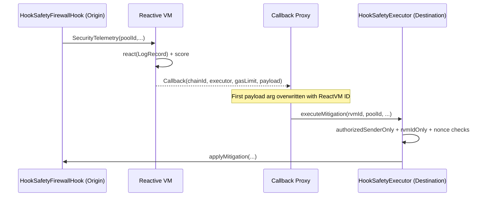

# Hook Safety-as-a-Service Spec

Integrations: [](https://docs.uniswap.org/contracts/v4/overview) [](https://dev.reactive.network/)

## 1. Objective

Build a deterministic, onchain security firewall for Uniswap v4 pools that use hooks.

Scope:

- Observe swap telemetry in a v4 hook.
- Stream telemetry into a Reactive contract.
- Compute deterministic risk from fixed heuristics.
- Execute mitigation with authenticated callback flow:
  - dynamic fee adjustments
  - temporary throttling
  - temporary pause windows

No offchain ML is used in core risk decisions.

## 2. System Model

```mermaid
flowchart LR
    A[Origin: Uniswap v4 Pool + HookSafetyFirewallHook] -->|SecurityTelemetry event| B[Reactive Network: HookSafetyReactive react(LogRecord)]
    B -->|Callback event with payload| C[Destination: HookSafetyExecutor]
    C -->|applyMitigation| A

    A -. beforeSwap checks .-> D[Throttle/Pause gate]
    A -. dynamic fee override .-> E[LP fee hardening]
```

### 2.1 Components

- `HookSafetyFirewallHook`
  - Uniswap v4 hook implementing `beforeSwap` and `afterSwap`.
  - Emits deterministic telemetry.
  - Enforces local emergency throttling/pause.
  - Accepts callback mitigation updates only from authorized executor.
- `HookSafetyReactive`
  - Subscribes with `subscribe(...)`.
  - Processes `react(LogRecord)`.
  - Scores risk and emits `Callback(...)` mitigation payload.
- `HookSafetyExecutor`
  - Validates callback sender (proxy) and ReactVM ID.
  - Enforces replay protection + idempotence.
  - Writes mitigation to the hook.

## 3. Callback Security Pattern



Authentication requirements:

- `msg.sender == CallbackProxy`
- callback arg #1 equals expected ReactVM ID
- nonce strictly increasing per pool

## 4. Risk Model

All signals normalized to basis points `[0..10000]`.

Let:

- `P = priceDeviationBps`
- `V = volumeSpikeBps`
- `S = slippageAnomalyBps`
- `L = liquidityImbalanceBps`
- `T = temporalCorrelationBps`
- `M = mevHeuristicBps`

Weights:

- `wP=2200, wV=1800, wS=1800, wL=1300, wT=1400, wM=1500`

Computed score:

`rawBps = (P*wP + V*wV + S*wS + L*wL + T*wT + M*wM) / (wP+wV+wS+wL+wT+wM)`

`score = ceil(min(rawBps,10000)/100)`

Final reactive score blends hook local score and reactive computed score:

`finalScore = floor((computedScore + localHookScore) / 2)`

### 4.1 Feature Definitions

- Price deviation:
  - `abs(currentPrice - baselinePrice) / baselinePrice`
- Volume spike:
  - `currentAbsVolume / emaVolume`
- Slippage anomaly:
  - tick jump magnitude mapped to bps
- Liquidity imbalance:
  - `abs(currentLiquidity - emaLiquidity) / emaLiquidity`
- Temporal correlation:
  - high value for compressed inter-arrival times
- MEV heuristic:
  - composite of high price deviation + high volume spike + short timing + direction/tick inconsistencies

## 5. Mitigation Policy

Thresholds:

- Medium: `>= 55`
- High: `>= 80`

Actions:

- Medium:
  - tier 1
  - short throttle window
  - elevated fee schedule
- High:
  - tier 2
  - pause + longer throttle
  - emergency fee schedule

### 5.1 Deterministic Hooks Enforcement

`beforeSwap`:

- reverts if paused or throttled window active
- returns fee override only for dynamic-fee pools (Uniswap v4 rule)

`afterSwap`:

- updates local EMA/baselines
- computes local score
- emits telemetry
- can trigger local emergency tier even before Reactive callback arrives

## 6. Uniswap v4 Compliance Notes

- Hook permissions are encoded in address bits.
- Hook address is mined with flags for `beforeSwap` + `afterSwap`.
- Hook entry points are `onlyPoolManager`.
- `PoolKey` / `PoolId` / `StateLibrary` are used directly from v4 core/periphery libs.
- Dynamic fee override path is only used when pool fee is `DYNAMIC_FEE_FLAG` and override flag is set.

## 7. Reactive Compliance Notes

- Uses system `subscribe(...)` registration.
- Implements `react(LogRecord)` entrypoint.
- Emits `Callback(...)` with payload whose first argument is placeholder `address(0)`.
- Destination contract expects first argument replacement by ReactVM ID.
- Dual-state behavior documented:
  - Reactive network instance manages subscriptions.
  - ReactVM instance processes logs (`vmOnly`).

## 8. Security Review Summary

Covered controls:

- callback authenticity validation
- replay protection (strict per-pool nonce monotonicity)
- idempotent mitigation handling
- reentrancy guard on executor
- bounds checks on score/tier
- explicit privilege boundaries (owner/executor/callback proxy)

Residual risks:

- false positives during extreme market breaks
- adversarial behavior against pool-specific heuristics
- protocol-layer upgrades in external dependencies

## 9. Testing Strategy

- Unit tests: hook, reactive, executor, risk math
- Security tests: callback auth and bad RVM path
- Fuzz tests: risk bounds + executor invariants
- Integration tests: telemetry -> callback -> mitigation lifecycle

## 10. Assumptions / TBD

- `/context/uniswap` path requested in mission is represented as `/context/uniswap_docs` in this repository.
- Commit `3779387` is interpreted as the pinned Uniswap v4 **periphery** commit; core is pinned to its linked submodule commit.
- Local integration tests simulate Reactive callback proxy payload rewrite by patching callback arg #1 in test harness.
- Full production deployment runbooks assume RPC credentials and funded keys are provided externally.

## 11. Demo Workflow (End-to-End)

`scripts/demo/sepolia.sh` executes and logs a full deterministic lifecycle in phases:

1. Resolve deployments
   - Ensures hook/executor contracts are deployed (`scripts/deploy/unichain.sh`).
   - Loads deployed addresses from `deployments/sepolia.json`.
2. Security baseline setup
   - Authorizes executors on hook.
   - Configures demo pool key + fee tiers.
3. Attack simulation (user perspective)
   - Simulates user-facing attack window reset.
4. Detection trigger
   - Simulates callback-driven medium-risk mitigation.
5. Mitigation execution
   - Escalates to emergency-tier mitigation with pause/throttle windows.
6. Outcome proof
   - Reads final pool state and prints tier/fee/pause/throttle values.
   - Prints tx hashes with Unichain Sepolia and Lasna URL slots for each phase.
